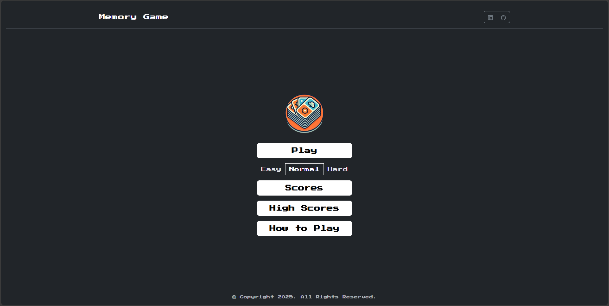
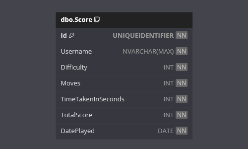

    
    <h1>Memory Game</h1>

Welcome to the **Memory Game** App!

This is a .NET project designed to demonstrate building a Blazor application that manipulates the state of a complex UI.

Memory Game is a web-based game developed soley using .NET!
Players match cards on a board with increasing levels of difficulty and compete for a place on the High Scores Leaderboard!

The web front end is delivered by a Blazor Web App and utilises Bootstrap for styling.
There is an integrated SQL Server database in the back end.

## Requirements

This application fulfills the following [The C# Academy - Memory Game](https://thecsharpacademy.com/project/40/memory-game) project requirements:

- [x] Your memory game should have a timer.
- [x] Once a game is finished it should record the date it was played and the time it took to finish in a "games" table.
- [x] You should have just one level of difficulty.
- [x] Your game should have 9 cards.
- [x] The app should have two main components: the game and the games list.
- [x] You shouldn't need a database for the game functionality. All the information about the cards can be in lists in the code base.
- [x] Since it only requires basic operations, use Entity Framework for recording game history.

## Challenges

This project has the following challenges:
- [x] Add difficulty levels to your game: more cards.
- [x] Add a search functionality to the games list.

## Features

- **Blazor**:
  - The web front end has been built with Blazor Web App v9.
- **Bootstrap**:
  - The web UI is styled using Bootstrap v5.3.3.
- **Game Difficulty**:
  - There are three levels of difficulty to challenge the users.
- **Timer & Move Counter**:
  - The game keeps track of moves and time taken to complete.
- **Scores**:
  - The users can view, filter and order scores.
- **High Score Leaderboard**:
  - Each score is tracked, and the top 10 are shown on the leaderboard.
- **Entity Framework Core**:
  - Entity Framework Core is used as the ORM.
- **SQL Server**:
  - SQL Server is used as the data provider.
- **Responsive Web Design**:
  - A user-friendly web interface has been designed to work on various devices.
  
## Technologies

- .NET
- Blazor
- Bootstrap
- HTML
- CSS
- Entity Framework Core
- SQL Server

## Getting Started

**IMPORTANT NOTE**:

The `InitialCreate` database migration has been created.

On start-up of the **Web** application, any required database creation/migrations will be performed.

### Prerequisites

- .NET 9 SDK.
- An IDE (code editor) like Visual Studio or Visual Studio Code.
- A database management tool (optional).

### Installation

1. Clone the repository:

   - `git clone https://github.com/chrisjamiecarter/memory-game.git`

2. Navigate to the Web project directory:

   - `cd src\MemoryGame.Web`
	
3. Configure the application:

	- Update the connection string in `appsettings.json` to target your SQL Server.
	
4. Build the application using the .NET CLI:

   - `dotnet build`

### Running the Application

1. You can run the Web application from Visual Studio.

OR

1. Run the Web application using the .NET CLI in the Web project directory:

   - `cd src\MemoryGame.Web`
   - `dotnet run`

2. Navigate to `https://localhost:7023` on your choice of web browser.

## Usage

Please refer to the short YouTube video demonstration below:

## How It Works

- **Web Project**: This project uses Blazor Web App v9 to serve .NET pages to your web browser. Interactive render mode provides interactability.
- **Web Design**: This project uses Bootstrap v5.3.3 to style the app and provide a responsive web design.
- **Play**: The start game handler is triggered, which generates a shuffled set of random cards, of which the amount is based on the selected difficulty. The cards are then displayed on the game board and a timer is started.
- **Card Matching**: Users select cards which flips them and shows the front, once two are selected a match cards handler is triggered, which will return true or false. Matched cards remain flipped, otherwise they are reset.
- **Save Score**: Once a game is completed, the finish game handler is trigger; this returns a score, calculated by the difficulty, moves taken and time taken. The user can opt to input a username and save the score to the database, which triggers the save score handler to do so.
- **Scores**: A user can view, filter and order score data.
- **High Scores**: The top 10 scores and displayed as a leaderboard, with highlighted first, second and third places.
- **Data Storage**: A new SQL Server database is created and the required schema is set up at run-time, or an existing database is used if previously created.
- **Data Access**: Interaction with the database is via Entity Framework Core.

## Project Architecture

This project implements the **Vertical Slice** architecure to organize the application logic and keep related code together based on specific use cases.
This approach focuses on creating a feature complete from top to bottom, with everything needed to process that particular piece of functionality (including models, logic, and data access) in a single place.
Any shared components/resources are extracted out into a Shared namespace.

Each feature or functionality (e.g., scoring, game start, high scores) is a self-contained "slice" that contains everything needed for its domain:

- **Features**: Every action or resource corresponds to a feature with its own request/response handlers.

- **Handlers**: A handler class processes each request and executes relevant logic, such as interacting with the database, processing requests, and returning responses.

- **Response Models**: Each handler returns response models encapsulating the result data.

This architecture allows each feature to evolve independently and facilitates easier testing, maintenance, and scalability of the project.

## Database

---

**_Happy Memory Gaming!_**
